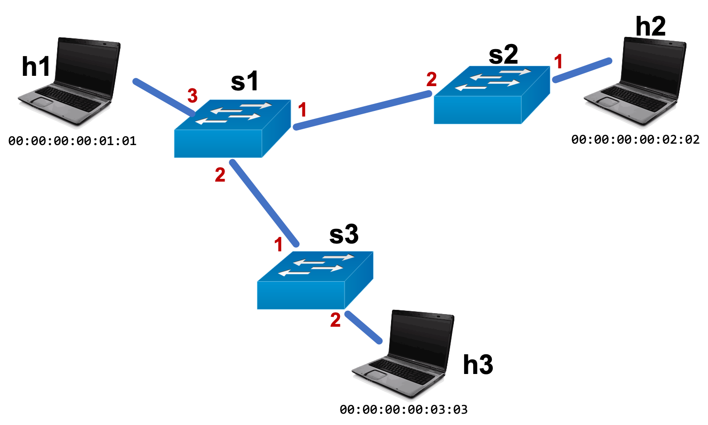

# Project 1: Implementing a Learning Switch

This project is to be done individually.  Please refer to Canvas for the deadline.

## Introduction

In the project, we will begin our dive into the internals of the Internet.
We will start with implementing a simple Layer-2 Ethernet learning switch.

Ethernet as a standard (IEEE 802.3) defines behavior at both the physical and link layers.
The first Ethernet standard was for a 10 Mbps network and didn't even include support for switching (all packets were broadcast).
Many revisions to that standard have since been published, with the most recent (2017) allowing for 400 Gbps networks - and increase of 40,000x!
Despite the fact that today's networks look very different than the original Ethernet deployments, many of the original ideas of Ethernet have remained, adapted, and thrived.
Today, nearly all wired networks use Ethernet to communicate within the local-area network.

Although Ethernet also defines some Layer-1 behavior, in this class, we will focus on the Layer-2 aspects of Ethernet.
Messages at this layer are called *frames*, and for Ethernet, they are structured as follows:

[Wikipedia: Ethernet Frames](https://en.wikipedia.org/wiki/Ethernet_frame#Structure)

A learning Ethernet switch is a Layer-2 switch that keeps a forwarding table (destination MAC -> egress port), and learns the content of the table automatically.
Whenever the switch receives a frame, it first learns the source MAC address mapping of the frame.
To send the frame to its destination, it then checks to see if it knows where to send the frame.
If it does, it sends it directly.
If it does not, it sends the packet out of all other interfaces.


## Part A: More information about the framework

The Mininet framework in this project is almost identical to the one in Homework 0.
You should `git clone` the directory into your `/vagrant` directory, alongside 553-hw0.

One small change we've make is to the sending script.
Rather than just sending packets in one direction and listening for their reception using `tcpdump`,
now we'll make sure that we can do what's called a *ping*.
Basically, a ping is when a host sends a message to a remote node, and the remote node immediately sends back a message in response.
Assuming that the target host is configured to send back responses to these ping requests, pings enable users to test both directions of a network path, on demand.
If you've ever run `ping google.com` to test your Internet connection, you've used a similar utility.

Start up Mininet like you did in HW0:

```bash
vagrant ssh
# followed by
cd /vagrant/553-hw1
make clean
make run
```

As a reminder, the topology that this sets up is:



Since we're now dealing with Layer-2 switching, we've added MAC addresses to this diagram, i.e., `00:00:00:00:01:01`, `00:00:00:00:02:02`, and `00:00:00:00:03:03`.
To use the new ping script, run the following.
You don't need to start up the `tail_pcap.sh` script, although you can if you'd like.

```bash
# from h1's terminal
./send_l2_ping.sh 00:00:00:00:02:02
```

You should see a series of timeouts.
That's because the switches are not doing anything currently.
You can open up `data_plane.p4` and `control_plane.py` to verify this.
We've implemented the header definitions and parser of `data_plane.p4` and provided a workflow for the ingress control block, but left the tables and actions unimplemented.


## Part B: Implement the data and control planes

Your task in this project is to implement the data and control planes of an Ethernet learning switch.
Please read the included `textbook_reading-5.4.3.pdf` excerpt and refer to the lectures about learning switches.
Pay particular attention to the lists of steps on page 477 and 478.
From what you know about the data/control planes and P4, which of these steps do you think would go in the data plane, and which should go in the control plane?

The switch you will build will provide similar functionality to the one you implemented in HW0, except that this one will learn, on it's own, where to send packets.
In fact, your HW1 `control_plane.py` implementation should *not* include any specialization based on `id_num`.
Note that, for simplicity, we will ignore *aging time* in this homework --- the learned forwarding table will only grow, and never shrink.

>#### Exercise
>Let's try to write down the switch-case statements that we expect from the data plane given the descriptions from class and the textbook reading.
>The cases will change during operation as the switch learns about new hosts in the networks, so let's just consider the case where all three switches have seen a packet *from* h1.
>
>In `pseudocode.txt`, for the above scenario, write down the desired behavior of each switch's ingress  block using only switch-case statements (you can omit the header and parser).
>Hint: at some point, you may find it useful to write lines of pseudocode to the effect of:
>
>`// Duplicate the packet to ports: {2, 3}`   
>`// Send [hdr.ethernet.srcAddr, standard_metadata.ingress_port] to control plane for learning`   
>`// Drop packet`

Let's talk about how to accomplish each of those tasks.


### Duplication: Multicast

Multicast is the process of taking a packet and replicating it to multiple destinations (as opposed to unicast, which always sends it to a single port).
Broadcast is a special case of multicast, where all destinations are sent the message.

In P4, you can configure via the control plane a *multicast group* that includes a set of ports.
Then, in the data plane, you can set `standard_metadata.mcast_grp` to the multicast group id to signal to the switch that it should replicate the packet to all of the ports in the multicast group.
The original packet is not forwarded separately.
In the control plane, you can create a multicast group using `buildMulticastEntry` and `AddMulticastGroup` functions.

#### More details

If you'd like to find out more about the detailed operation of multicast within the broader operation of the P4 switch, check out:

* [Portable Switch Architecture Specification](https://p4.org/p4-spec/docs/PSA.html#sec-after-ingress)

### Sending messages to the control plane: Digests

We have already covered communication from the control plane to the data plane via the functions in `switch.py`.
P4 also allows communication in the other direction.
Specifically, it allows you to send a predefined set of header fields to the control plane.
Just like the control->data plane channel, this communication is asynchronous and not intended to be done for *every* packet.

We have provided examples of the usage of digests within both `data_plane.p4` and `control_plane.py`.
You should be able to use this code almost directly.
In `data_plane.p4`, we have defined a digest struct:

```C++
struct ethlearn_digest_t {
    bit<48> srcAddr;
    bit<9>  srcPort;
}
```

We can send an object with this format to the control plane with the following, which populates an `ethlearn_digest_t` struct with the Ethernet source address and the physical port on which the packet arrived.
The first parameter to `digest()` is an identifier for the digest receiver.
You should leave this as 0 for our purposes.

```
action aiSendDigest() {
    ethlearn_digest_t mac_learn_digest = {hdr.ethernet.srcAddr,
                                          standard_metadata.ingress_port};
    digest(0, mac_learn_digest);
}
```

On the control plane side, we have provided all the code to read incoming digests and print them out.
`decodeMac()` and `decodeNum()` come from `utils/convert.py`.
The framework tries to do encoding for you as part of `utils/helper.py`, but decoding you need to handle on your own.


### Dropping packets: `mark_to_drop`

There is a convenient function in P4 that marks the packet for dropping: `mark_to_drop`.
Please note some oddities about this function.
First and foremost, marking the packet for drop does not actually drop it right away.
If you set the multicast or egress group after `mark_to_drop`, the packet will be revived.
Similarly, packets marked for digest and drop trigger both behaviors.


## Submission and Grading

Please submit your `data_plane.p4`, `control_plane.py`, and `pseudocode.txt` files to Canvas.  Make sure to **Indicate your name and Penn ID in a comment at the top of the file.**

As always, start early and feel free to ask questions on Piazza and in office hours.

